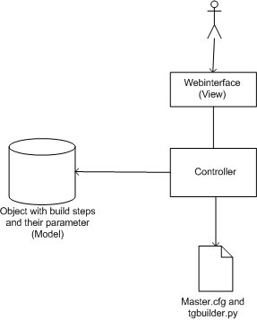

==================================================
Concept for a webinterface to configure BuildBot
==================================================

:Author: Steven Mohr
:Date: $Date$
:Revision: $Rev$
:Status: Draft

.. contents::

Abstract
---------
To configure BuildBot you have to edit the master.cfg file. It would be easier and less error-prone to
have a webinterface to create new build tasks, edit existing ones and configure schedulers.
This webinterface should use TurboGears.

Basics
-------

master.cfg + tgbuilder.py
  These are the config files of the BuildBot system. Both are just python code.
  tgbuilder.py contains the build tasks respectively the functions which create them.
  master.cfg contains all other config-related stuff.

tg_mbuildsteps.py
  This file includes the user-defined build steps. 

Build task and build task functions
  The difference between build tasks and build tasks functions is that build task functions create build tasks
  based on some parameters. Build tasks don't have special parameter and are designed for a special tasks.
  An example for a build tasks is the tg1builder function and for a build tasks function the dependencysvnbuilder.
  
Features
----------
must-haves:

  - generates build tasks and build task functions [#build_functions]_

nice-to-haves:
  
  - edit existing build taks
  - create and edit schedulers and triggers
  - edit status notifier

.. [#build_functions] The difference between a build task and a build task function is that a build tasks
    function has parameters to generate new build tasks like the dependencybuildersvn function.

Structure
----------

General workflow
++++++++++++++++++

#. parses tg_mbuildsteps for new build steps and adds them to the model
#. parse master.cfg and tgbuilder.py for existing build tasks and schedulers
#. user edits buildbot config via 
#. program generates new master.cfg and tgbuilder.py 

Initialisation
+++++++++++++++
First of all, the webapp has to parse the tg_mbuildsteps.py. If there are new user-defined build steps, they should
be added to the model. The next step is to parse master.cfg and tgbuilder.py. 

After it our model contains:

- table of all build steps and their parameters
- table of all build tasks and build tasks functions
- table of all schedulers
- table of all notifiers
- table of all build trigger

Webinterface (View)
++++++++++++++++++++
Based on the data from step one the view is created. On the left side you can select what to do:

- Create a new build task or function
- Edit an existing task or function
- Add a new scheduler
- Edit a new scheduler
- Edit status notifier

Create new buildtask
***********************
1. User selects "Create new build task" 
2. 

Create configuration
++++++++++++++++++++++
After the user made all his changes, the program creates a new master.cfg and a new tgbuilder.py.
All build tasks and build task functions are inserted in tgbuilder.py. All other commands are
inserted in master.cfg. The code to create a build tasks is very easy: Every build tasks is an
instance of BuildFactory. The build tasks are added with the member function .addStep. The creation
of this BuildFactory is encapsulated in a function. All of this functions are collected in tgbuilder.py.
They're called in master.cfg. That's all code which has to be created:

1. A function which encapsulates the creation of the build factory
2. A call of this function in master.cfg and connecting this function with a scheduler

All other part of the file are inserted via a template.

References
-----------

- Short article about Python code generators: http://effbot.org/zone/python-code-generator.htm