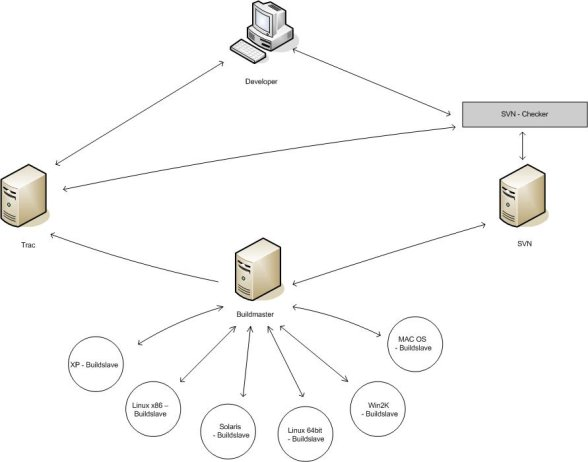
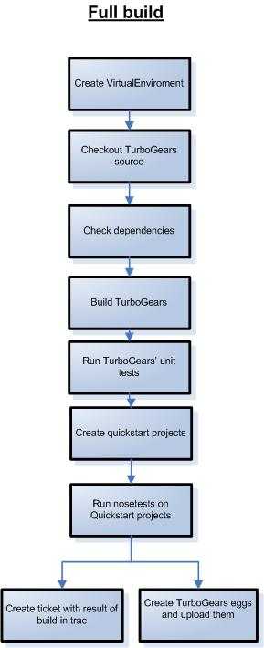

=========================================
Design document: TurboGears QA initiative
=========================================

:Author: Steven Mohr
:Date: $Date: 2008-07-27 21:23:33 +0200 (So, 27 Jul 2008) $
:Revision: $Rev: 5043 $
:Status: Draft

.. contents:: Table of Contents

Project description
-------------------

The goal of the project is to create a system enviroment which automates the
core tests and the creation of new TurboGears [#second]_ eggs. It should also
create eggs [#fifth]_ for the dependencies. The second goal was to install
SVNChecker [#first]_ and to configure it. This goal was replaced by the
creation of a webinterface which should be used to create new build tasks.
SVN Checker will be installed after Google Summer of Code.

Test and build environment
--------------------------

To create this test and build environment we use BuildBot [#bb]_. With BuildBot
you have one machine, called buildmaster, and a lot of other machines called
build slaves. For every supported OS or hardware arcitecture we need three
slaves: one for Python 2.3, one for 2.4 and one for 2.5.

Supported OS / architectures
~~~~~~~~~~~~~~~~~~~~~~~~~~~~

* Buildmaster (24h online)
* Buildslaves (often online)

  - WinXP
  - Win2k(3)
  - Windows Vista
  - Debianx86, Ubuntu64
  - Solaris (x86)
  - MacOS

=============  ==========  ==========  ==========
OS             Python2.3   Python2.4   Python2.5
=============  ==========  ==========  ==========
Debian x86     X           X           X
Ubuntu x64     X           X           X
Solaris        o           X           X
Windows XP     X           X           X
Windows 2003   X           X           X
Windows Vista  X           X           X
=============  ==========  ==========  ==========

Involved persons
~~~~~~~~~~~~~~~~

Buildmaster admin:
  Adds and changes buildtasks
Buildslave admin:
  Installs all needed depenpencies on the slave to guarantee proper builds
Report manager:
  Manages bug mails created by the build master and answer questions of the
  community according to them.
Developer:
  Commits source to the repo which activates a build; gets build reports via a
  special mailing list

Used components
~~~~~~~~~~~~~~~

Software
********

BuildBot
++++++++

BuildBot creates and manages the bot system.

VirtualEnv
++++++++++

VirtualEnv [#third]_ creates independent python installations to isolate the
build enviroment from the rest of the system. So it
guarantees proper build results.

Nose
++++

Nose [#fourth]_ is an unittest framework for python. The unit tests are
important to keep the code valid.

Build master
++++++++++++

The build master starts the builds and sends the signal to start to its slaves.
It also collects the results and presents them via a webinterface [#six]_. This
interface also allows to start builds manually. The build master will be
created as a part of this project.

Build slaves
++++++++++++

The build slave is the component where the build takes place. It downloads all
needed files from SVN (e.g. source or scripts) and distributes the results
(uploads created eggs) and publishes build reports in wiki [#wiki]_.

Build tasks
***********

Creation of binary eggs for all dependencies
++++++++++++++++++++++++++++++++++++++++++++

This is the way the eggs are created:

1. SVN check out or source download via easy_install
2. Creation of the egg
3. Running of core tests (if aviaible)
4. Upload to TurboGears EggBasket server

Binary eggs will be created for the following dependencies:

- Cheetah
- RuleDispatch
- simplejson
- PyProtocols
- cElementTree (Python 2.4)

Creation of binary eggs for TG
++++++++++++++++++++++++++++++

The build system creates eggs for TG 1.0, 1.1 and 2.0

This is the way the eggs are created:

1. Setting up a virtual environment
2. TG source check out [#svn]_
3. Installation of external dependencies
4. Installation of TG
5. Running unit tests (a failure will stop the build)
6. Creation of all possible quick start projects
7. Running unit test of quickstart projects
8. If unit tests fail, create a trac ticket (if applicable)
9. Creation of the egg and upload to TG server

Upload to TG server
+++++++++++++++++++

The eggs will be uploaded to a TurboGears EggBasket [#eggbasket]_ instance.

Nightly build of TurboGears documentation
++++++++++++++++++++++++++++++++++++++++++
The BuildBot system should also create the TurboGears documentation.

BuildBot webinterface
---------------------
The concept of the web interface is described in a different file (svn.turbogears.org/build/notes/bb_config.pdf)

SVNChecker
----------

SVNChecker is a framework which was designed to assist users to create hook
scripts for SVN. SVNChecker has a number of predefined classes which allow an easy
integration of bug tracking systems or coding style checkers. If a critical
test fails, the check in will be rejected.

Functions:

Pylint
  New code will be checked for correctness and conformance of coding standards.
XMLValidator
  Validates the xml code.
Interaction with trac
  (will be added when trac functions are implemented)
minimum log lenght
  each check-in log has to have a minimum lenght f.e. 15 characters

References
----------

- Project schedule TurboGears QA initiative (``project_schedule.rst``)
- Buildslave documentation (``buildslave.rst``)
- Buildmaster documentation (``buildmaster.rst``)
- Steven's blog: http://stevenmohr.wordpress.com
- Agile Testing: http://agiletesting.blogspot.com

.. [#first] http://www.svnchecker.tigris.org
.. [#second] http://www.turbogears.org
.. [#third] http://pypi.python.org/pypi/virtualenv
.. [#fourth] http://www.somethingaboutorange.com/mrl/projects/nose/
.. [#fifth] http://peak.telecommunity.com/DevCenter/setuptools
.. [#six] will be added
.. [#bb] http://www.buildbot.net
.. [#eggbasket] http://www.chrisarndt.de/projects/eggbasket/
.. [#svn] http://svn.turbogears.org/
.. [#wiki] http://docs.turbogears.org/
